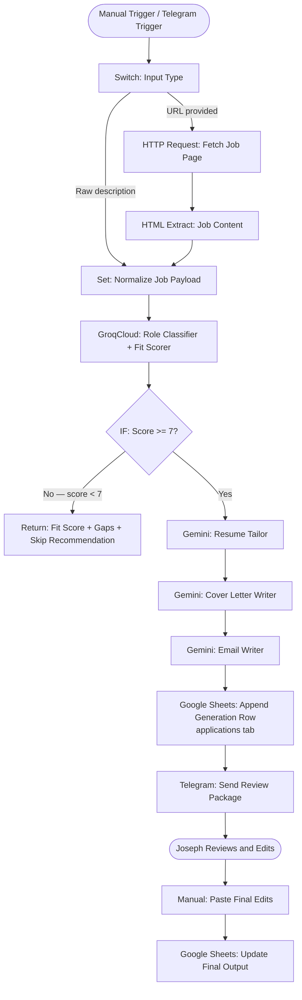
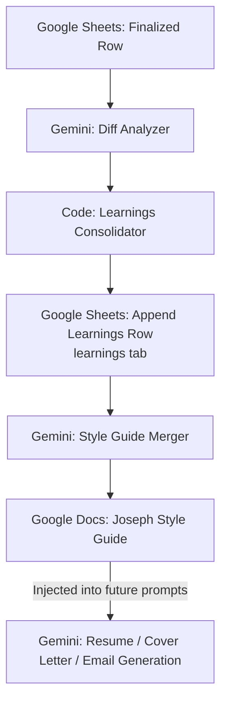

# Architecture

A self-improving job application automation system that takes a job URL or description as input and outputs a tailored resume, cover letter, and email draft using GroqCloud for fit scoring and Gemini for content generation. A learning loop stores diffs between AI-generated and human-edited outputs to improve future generations.

## V1 Flow

## V2 Learning Loop

## Component Map

| Component | Role |
|---|---|
| n8n | Workflow orchestration |
| GroqCloud (`llama-3.3-70b-versatile`) | Role classification and fit scoring |
| Gemini (`gemini-2.0-flash`) | Resume, cover letter, and email generation |
| Google Sheets (`applications` tab) | Stores generated and final-edited outputs |
| Google Sheets (`learnings` tab) | Stores per-application style diffs and patterns |
| Google Docs | Canonical Joseph Style Guide (V2) |
| Telegram | Review delivery and trigger |
| Python utils | Google auth helper + Sheets adapter |
